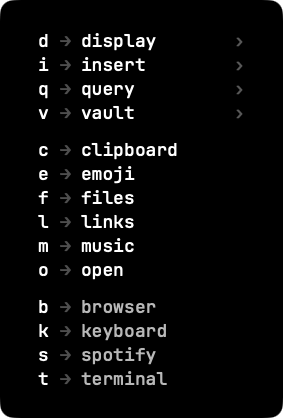

# Sottomano

A macOS launcher driven by one leader key.



Press ⌘space and a panel lists the keys available. Each key opens another layer,
opens something to search in, or acts and is done — so a command is a short
sequence rather than a shortcut to remember: `⌘space o` for the applications,
`⌘space c` for the clipboard, `⌘space v p` for a password.

- `escape` closes the panel, `delete` goes back one layer.
- A menu bar item carries the only two things it has to offer without a window:
  open at login, and quit.
- Everything is declared in `~/.config/sottomano/keymap.json`, which is read
  again whenever it is written. See `keymap.example.json`.

## What it does

- **Launch**, open a URL, run a command, type a snippet.
- **Search** in a list a command prints, with fuzzy matching and frecency: the
  applications, the emoji, your bookmarks, your playlists, your password
  manager. A list can name a picture for each row — a playlist cover, a favicon
  — and only the rows on screen are fetched.
- **Walk the filesystem** from the keyboard: the query filters where you are
  standing, return goes in, delete comes back out.
- **A clipboard history** that keeps text, pictures and files, sealed on disk
  with a key in the keychain. It skips whatever a password manager marks as
  concealed, and copies made by the browser extension of one, and pastes a
  file back as a file. ⌘⌫ removes a row. A
  timestamp — an epoch or an ISO 8601 date — says when it is, selecting it
  shows every form of it, and tab picks one to paste. A JSON document, Mongo
  shell output included, is pretty-printed, and tab picks a value to paste.
  A JWT opens to its header and payload, hex to a dump of its bytes, base64
  to what it encodes. ⌘1…8 picks a row by its place.
- **Ask for a query** and open it in whichever search engine, or search
  whatever is selected without being asked.
- **Take a colour off the screen** with the loupe, and get the hex back on the
  pasteboard.
- **Rearrange the displays**, cycle the keyboard layout, and make caps lock send
  escape when tapped on its own while staying control when held.

## Escape mappings

Set `"controlBracketEscape": true` at the top level of `keymap.json` to make
Control+[ send plain Escape immediately on keydown, including in GUI apps.
It is off by default and independent of `capsEscape` (Control released on its
own sends Escape). Both options reload when the configuration changes.

The chord uses the physical left-bracket key (keycode 33), even on another
keyboard layout. Additional modifiers are cleared, so the result is always
plain Escape. Key repeats and release are remapped too.

Both mappings require Accessibility permission and stop during macOS Secure
Input. Neither limitation affects the launcher hotkey or panel.

## Install

```sh
brew install --cask samirettali/tap/sottomano
```

Or build it: `make run` needs a Swift toolchain from Xcode or the Command Line
Tools.

## Where it comes from

I started with [Leader Key](https://github.com/mikker/LeaderKey), which is the
idea in its plainest form. Then I moved to [Hammerflow](https://hammerflow.dev),
a wrapper around the RecursiveBinder spoon that puts the whole tree in one TOML
file. To change what it did I ended up lifting its code into my own Hammerspoon
setup, and kept changing it from there.

Leaving Hammerspoon was the last step, and it bought two things. Latency first:
the panel there took three or four frames to appear, this one lands within one.
Then the event tap it was drawn by, which macOS stops feeding while Secure Input
is held — exactly when a password field has the focus. Here the panel is an
`NSPanel` that reads `NSEvent` directly and the hotkey is `RegisterEventHotKey`,
so there is no tap to starve.

That is the argument for writing one. An agent writes the Swift, so the app that
fits one person's habits exactly costs about as much as bending a general one
into shape, and nothing has to be a setting.

## Licence

MIT.
